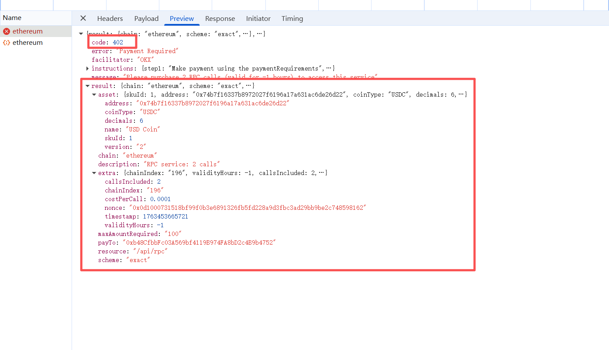
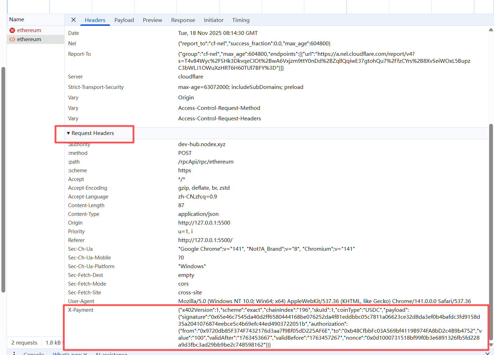

# rpc-doc
1、连接钱包 -> 选择商品即rpc(分页展示就调/api/rpcPageList，不分页就调/api/rpcList，根据前端页面实际来) -> 选择商品下的sku(skuList中的数据) -> 选择链(availableChains中的数据) -> 选择支付币种(每个链coins的数据);

2、上面选择完成后，下单时调用 POST /api/rpc/{chain}接口，传参说明：
	1）接口路径上的chain参数：步骤1中选择的rpc名称(rpcName字段的值)
	2）body中json传参：
	{"skuId": skuList中的对应的id ,"chainIndex":"availableChains中对应的chainIndex","coinType":"coins对应的值"}
	
	3）如果接口返回状态码为402

	

	4）使用返回的result中的信息封装请求头X-PAYMENT，再次请求POST /api/rpc/{chain} (chain参数就是前面选择的商品rpc，第3步402时接口也返回了的，result中的chain字段)
	
	X-PAYMENT请求头示例：
	
	{
    "x402Version": 1, // 固定
    "scheme": "exact", // 传第三步返回的result中的scheme字段值
    "chainIndex": "196", // 传第三步返回的result中的extra中的chainIndex字段值
    "skuId": 1, // 传第三步返回的result中的asset中的skuId字段值
    "coinType": "USDC", // 传第三步返回的result中的asset中的coinType字段值
    "payload": {
        "signature": "0x8e32f69038849ef6e7abfe4bd031b515987df047d49dbfd71a888794d0d9e06903d49fcbaac5a14a17308d6328cb351448631a032a73fa8b03c366f1cfe936831c", // 根据规则生成，可以参考我的调试页面中的生成方式
        "authorization": {
            "from": "0x9720db85F374F7432176d3aa7f9Bf05dD225AF6E", // 用户连接钱包地址
            "to": "0xb48CfbbFc03A569bf4119B974FA8bD2c4B9b4752", // 传第三步返回的result中的payTo字段值
            "value": "100", // 传第三步返回的result中的maxAmountRequired字段值
            "validAfter": "1763449808", // 当前时间的 Unix 时间戳（秒）
            "validBefore": "1763453408", // validAfter + 3600
            "nonce": "0xe5f6b8d640e3dc6747a8f63ec32b27522af19abe1ee841ba093a37d31c9996ae" 传第三步返回的result中的extra中的nonce字段值
        	}
   		}
	}
	

