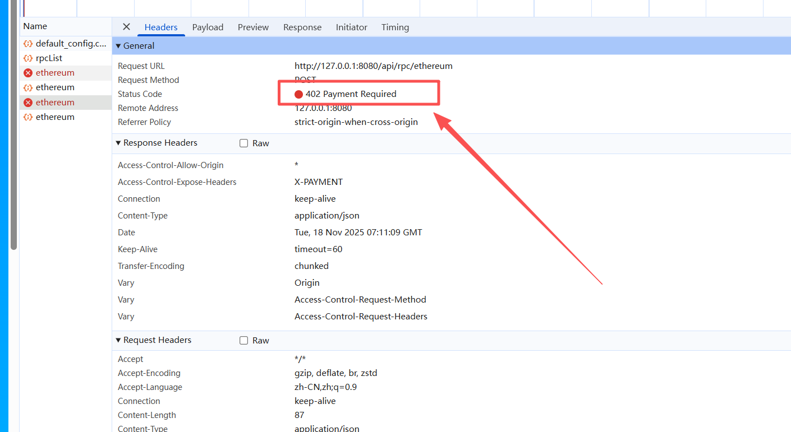

# rpc-doc
1、连接钱包 -> 选择商品即rpc(分页展示就调/api/rpcPageList，不分页就调/api/rpcList，根据前端页面实际来) -> 选择商品下的sku(skuList中的数据) -> 选择链(availableChains中的数据) -> 选择支付币种(每个链coins的数据);

2、上面选择完成后，下单时调用 POST /api/rpc/{chain}接口，传参说明：
	1）接口路径上的chain参数：步骤1中选择的rpc名称(rpcName字段的值)
	2）body中json传参：
	{"skuId": skuList中的对应的id ,"chainIndex":"availableChains中对应的chainIndex","coinType":"coins对应的值"}
	
	3）如果接口返回状态码为402
    